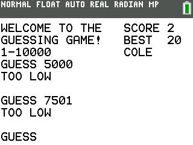
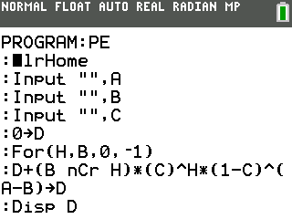

# TI Programs

Load some fun programs onto your ti84 plus CE! 

## Usage

* Clone the github repo onto your ti84 plus CE device, either physical or virtual. You can't actually use git from the calculator as far as I know of so you'll have to find a way to transfer the (TI-connect, EUcm, etc).
* Make sure all the files are in the calculators RAM.
* Start one of the main programs!

### Minesweeper

The most substantive of the listed games. Main program: MINE

| File     | Description                                                                                                     |
|----------|-----------------------------------------------------------------------------------------------------------------|
| MINE     | Start game menu                                                                                                 |
| DONE     | Display loading screen and calculate the neighboring mines for each square                                      |
| PRO      | This is where the game actually gets played. Listens for key presses and updates the game appropriately         |
| SETMINES | Randomly sets mines throughout the board                                                                        |
| YX       | Randomly selects the starting cursor position such that it will reveal a location without any neighboring mines |
| CLEAR    | Reveals directly adjacent tiles after revealing a zero                                                          |
| CLEAR2   | Reveals secondary adjacent tiles after revealing a zero                                                         |
| LOSE     | Reveals all the mines and then wipes the board                                                                  |
| END      | Displays end game statistics                                                                                    |

Associated blog post.

### Guessing Game

Simple guessing game for a number between 1 and 10000 with a first place leader board. This is the first time I became familiar with binary search.

Make sure to run GUESSSET after resetting calculator RAM to set variables.

### Prank

This program tries to act in stealth mode without the user noticing. There are two versions.  The first one will occasionally bring the user to the graph display instead of performing a computation, potentially leading someone to think they are going crazy. The second will occasionally adjust the output of an arithmetic expression by minor amounts, potentially leading someone to think their calculator is broken.

If you are very fast you can code and run these programs onto a friends calculator while they aren't paying attention.

### Self Destruct

I'll leave this for you to try out.

### PE

Seems to correspond to some math equation, but I haven't been able to figure out which one.

